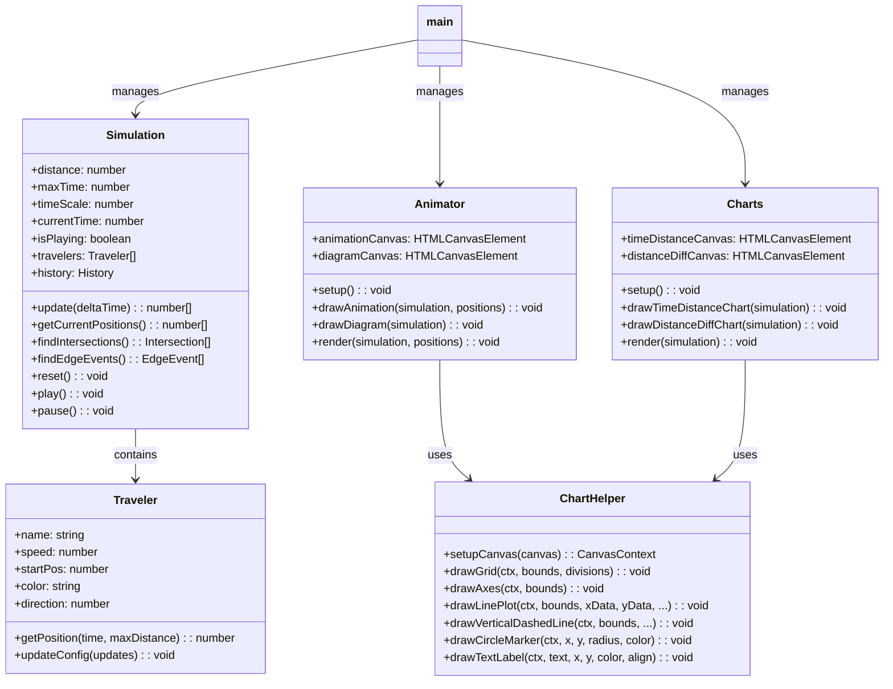

# 旅人算シミュレーター Ver 2.0 - 設計ドキュメント

## 概要

旅人算シミュレーターは、中学受験算数の旅人算（出会い・追い越し問題）を視覚的に学習できるWebアプリケーションです。

Ver 2.0 では、コードの保守性と拡張性を向上させるために、オブジェクト指向設計に全面リファクタリングしました。

## アーキテクチャ

### クラス図



## ファイル構成

```
apps/traveler-simulator/
├── index.html              # メインHTML
├── design.md               # 設計ドキュメント（このファイル）
├── css/
│   └── style.css           # スタイルシート
└── js/
    ├── main.js             # エントリーポイント、イベントハンドリング
    ├── app.js              # 旧バージョン（バックアップ）
    ├── models/
    │   ├── Traveler.js     # 旅人クラス（位置計算、往復ロジック）
    │   └── Simulation.js   # シミュレーション状態管理
    ├── views/
    │   ├── Animator.js     # アニメーション描画（道路、線分図）
    │   └── Charts.js       # グラフ描画（時間-距離、距離差）
    └── utils/
        └── ChartHelper.js  # グラフ描画共通ユーティリティ
```

## 機能一覧

### 実装済み機能

1. **基本機能**
   - 2人の旅人の設定（名前、速さ、開始位置）
   - 両端の距離設定
   - 再生/停止/リセット制御
   - 再生速度調整（0.5x - 5x）

2. **アニメーション**
   - 道路上の人物移動表示
   - 往復動作（端で折り返し）
   - 現在時刻表示

3. **グラフ表示**
   - 時間-距離グラフ（両者の軌跡を色分け表示）
   - 距離差グラフ（2人の間の距離の推移）
   - 交点検出と表示（出会い: 赤、追い越し: 青）
   - 端到達イベント表示（緑の点線）

4. **線分図（軌跡図）**
   - 通った道を線で表示
   - 折り返しごとに位置をずらして描画
   - 出会い/追い越しの位置に縦線マーカー

5. **UI機能**
   - 使い方ガイドモーダル
   - スライダーと数値入力の連動
   - レスポンシブ対応（固定サイドバー）

### 今後の拡張候補

- 3人以上の旅人対応
- 移動モード切り替え（往復/突き抜け/停止）
- 途中で休む、速さが変わる応用問題
- グラフの交点クリックでその時刻にジャンプ
- プリセット設定（速さの比など）
- モバイル最適化

## 技術仕様

- **言語**: JavaScript (ES Modules)
- **描画**: Canvas 2D API
- **DPR対応**: Retina/高解像度ディスプレイ対応
- **外部依存**: なし（軽量設計）

## 変更履歴

| バージョン | 日付 | 内容 |
|-----------|------|------|
| 2.0 | 2026-01-29 | 全面リファクタリング（クラス設計、ES Modules化） |
| 1.0 | 2026-01-29 | 初版リリース |
